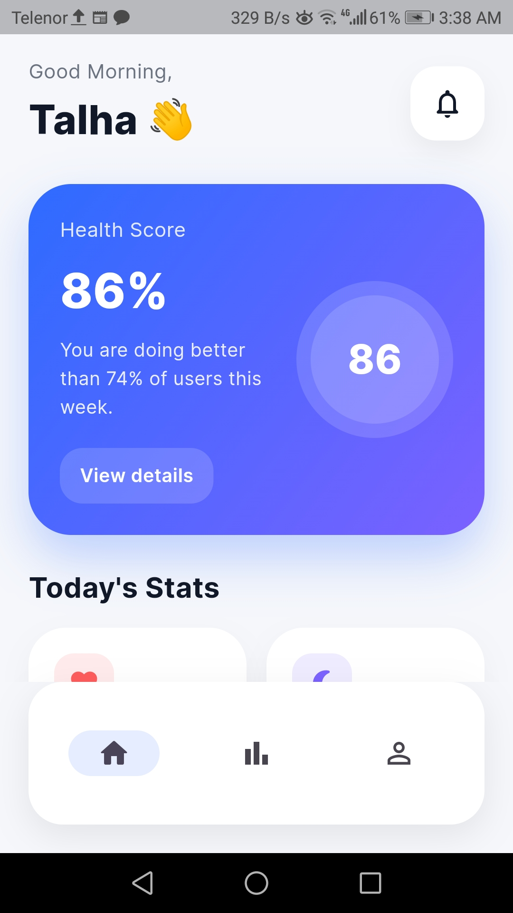
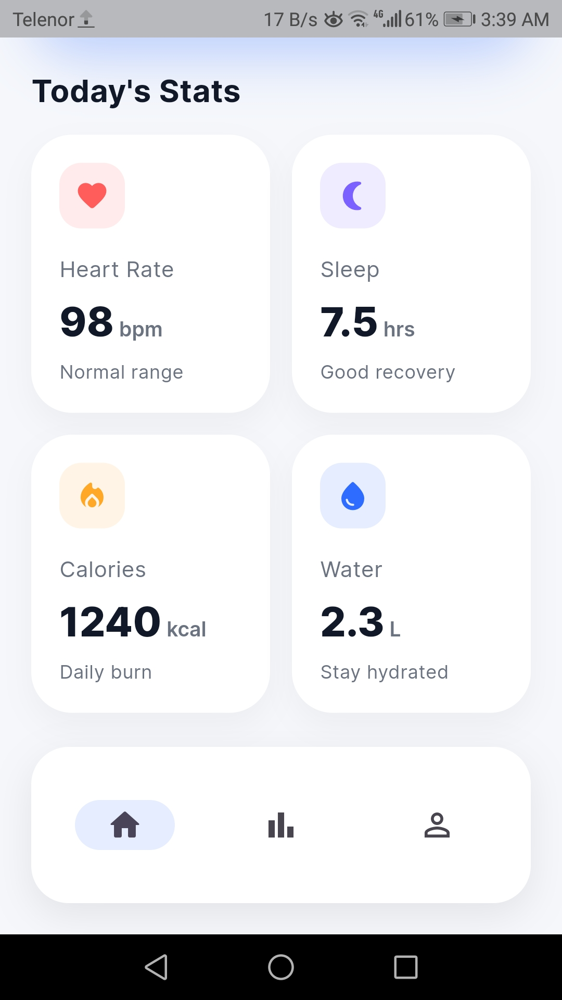
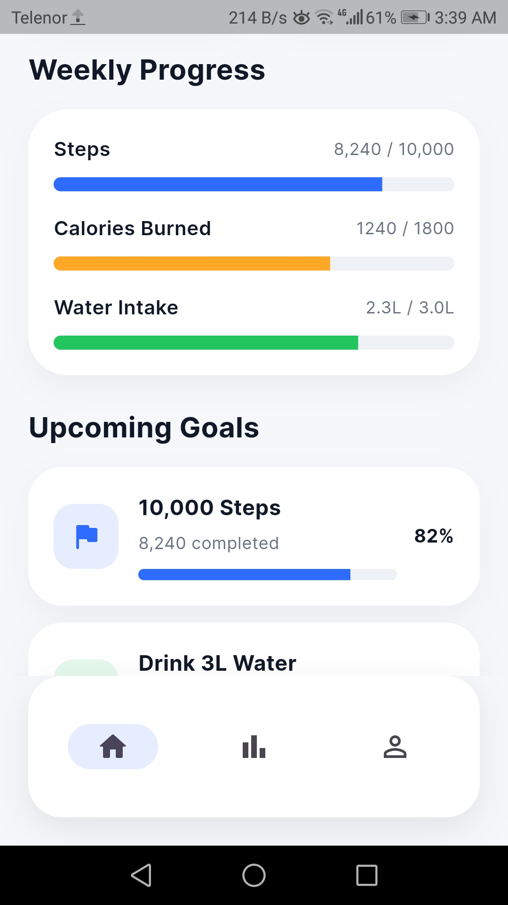
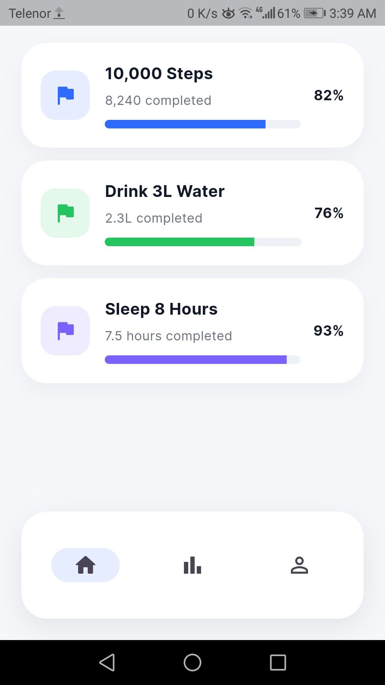
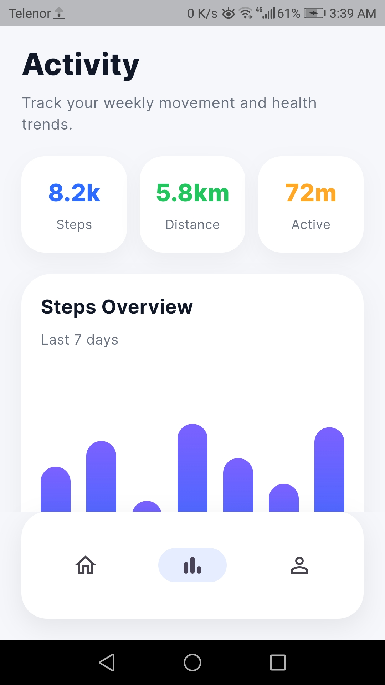
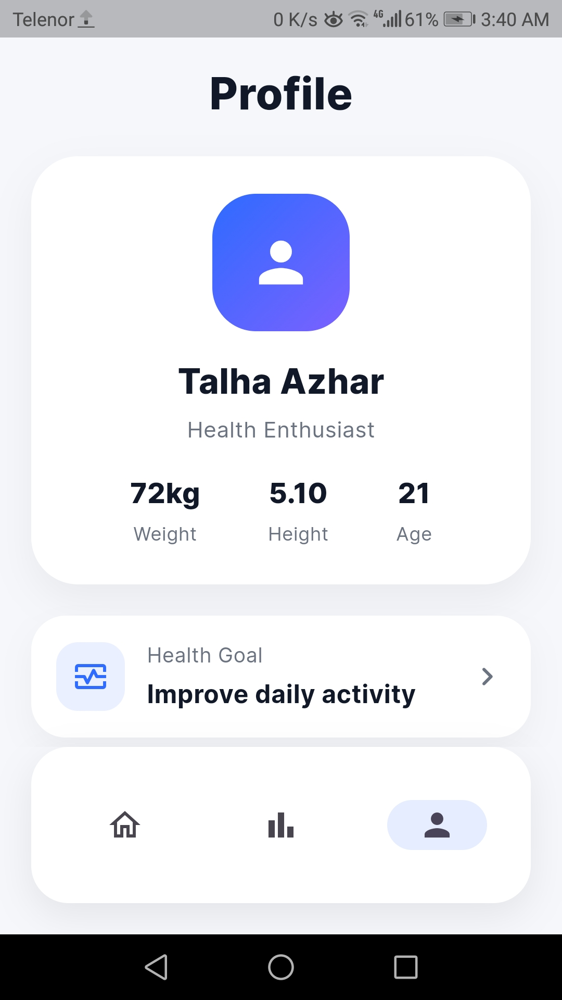
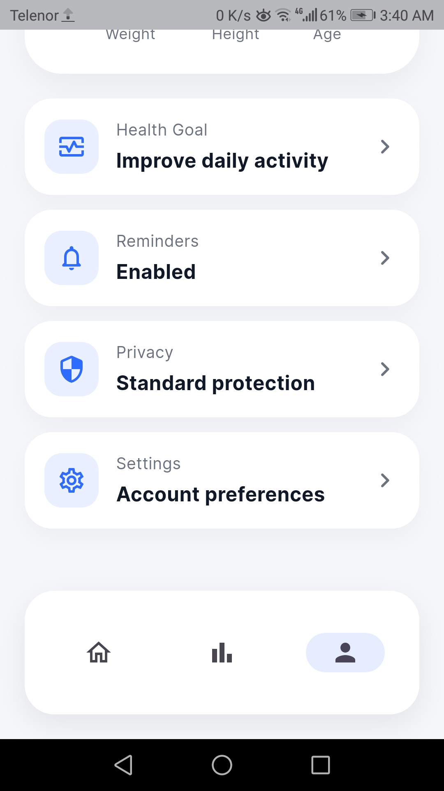

# Flutter Health Dashboard UI

A clean and modern Flutter health dashboard UI built for portfolio and Fiverr client showcase.

## Features
- Pixel-perfect UI
- Dashboard with stats cards
- Activity analytics screen
- Profile screen
- Bottom navigation
- Reusable widgets

## Tech Stack
- Flutter
- Dart
- Material 3
- Google Fonts

## Purpose
Built to showcase Figma/XD/PSD to Flutter conversion skills.

## Screenshots

### 🏠 Home Dashboard

### 📊 Activity Analytics

### 👤 Profile Screen

